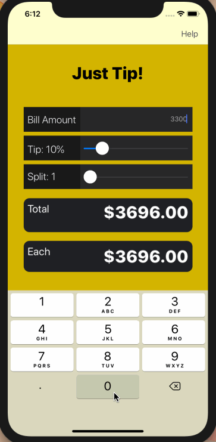

# Pre-work - *Just Tip*

**Just Tip** is a tip calculator application for iOS.

Submitted by: **Eliza Vardanyan**

Time spent: **5** hours spent in total

## User Stories

The following **required** functionality is complete:

* - [x] User can enter a bill amount, choose a tip percentage, and see the tip and total values.
* - [x] User can select between tip percentages by tapping different values on the segmented control and the tip value is updated accordingly

The following **optional** features are implemented:

* [ ] UI animations
* [ ] Remembering the bill amount across app restarts (if <10mins)
* [ ] Using locale-specific currency and currency thousands separators.
* - [x] Making sure the keyboard is always visible and the bill amount is always the first responder. This way the user doesn't have to tap anywhere to use this app. Just launch the app and start typing.

The following **additional** features are implemented:

- [x] Help button to guide how to sue the app and what tip percentage to choose

## Video Walkthrough

Here's a walkthrough of implemented user stories:

GIF created with [LiceCap](http://www.cockos.com/licecap/).

## Notes

My fellow colleague Yujeong and I were very delighted to be given the opportunity to apply for CodePath tech fellow position. We enjoyed the process of learning and working with Swift and we hope to develop our skills even further with the help of CodePath. 

## License

    Copyright [yyyy] [name of copyright owner]

    Licensed under the Apache License, Version 2.0 (the "License");
    you may not use this file except in compliance with the License.
    You may obtain a copy of the License at

        http://www.apache.org/licenses/LICENSE-2.0

    Unless required by applicable law or agreed to in writing, software
    distributed under the License is distributed on an "AS IS" BASIS,
    WITHOUT WARRANTIES OR CONDITIONS OF ANY KIND, either express or implied.
    See the License for the specific language governing permissions and
    limitations under the License.

# Just Tip

Just Tip is an application written in Swift for iOS that calculates the tip and the total amount due for payment. This code was submitted as a pre-work for CodePath.

## Usage

To use it, all you need to do is type the bill amount, select desired tip percentage as well as number of people to split the bill with and the application will give the total amount that is due.

## Contributing
Pull requests are welcome. 

Here is a brief walkthrough of how Just Tip works:

GIF  was created with Recordit.

Notes:

